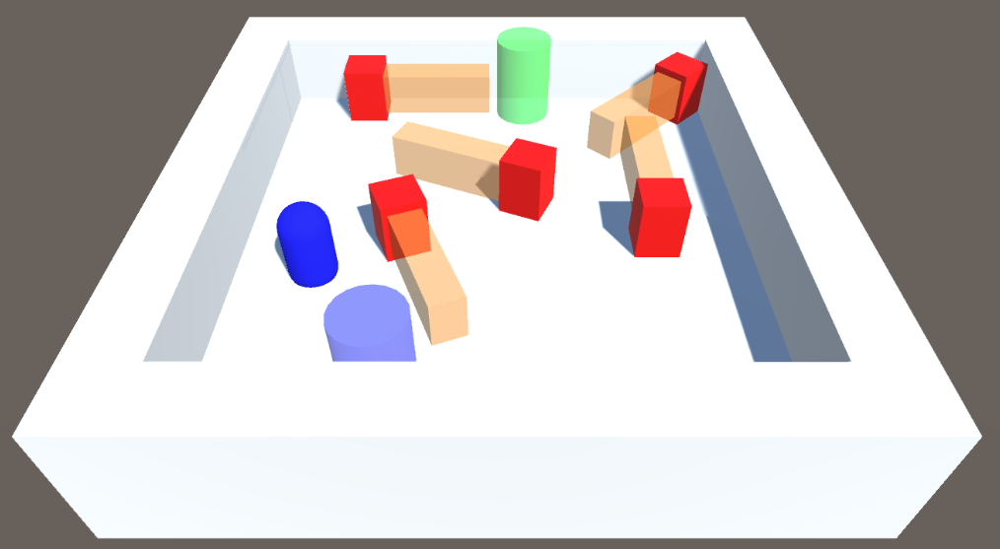

# Procedural generation of levels for a stealth video game

This repository contains the code and the [design document](ai-design-document.pdf) for the University project "Artificial Intelligence for Video Games" at UniMI.

The goal of the project was to develop an algorithm that procedurally generates levels (game field, start and end points, enemies) for a simple 2D stealth game.

## Additional information

Read the [design document](ai-design-document.pdf) of the project.

Probably the most interesting and innovative part is the one about the solvability algorithm. Briefly, the algorithm works iteratively by simulating player possible movements using a flood-fill like algorithm and by updating enemy positions. If the player is able to reach the goal in a certain amount of steps, the level is considered solvable; otherwise, it is considered unsolvable.